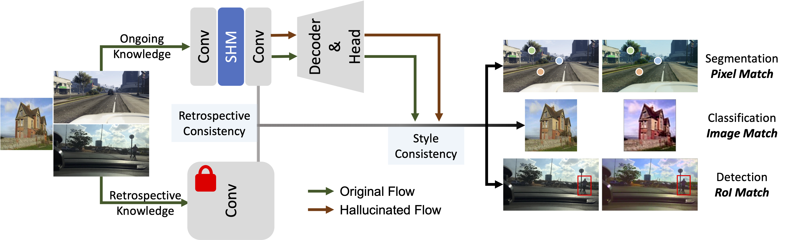

## Style-Hallucinated Dual Consistency Learning: A Unified Framework for Visual Domain Generalization

[](https://opensource.org/licenses/Apache-2.0)


**by [Yuyang Zhao](http://yuyangzhao.com), [Zhun Zhong](http://zhunzhong.site), [Na Zhao](https://na-z.github.io/), [Nicu Sebe](https://disi.unitn.it/~sebe/), [Gim Hee Lee](https://www.comp.nus.edu.sg/~leegh/)**

**[[Arxiv]](https://arxiv.org/abs/2212.09068)**

:bell: This is the extension of our **[ECCV2022 Paper: SHADE](https://arxiv.org/pdf/2204.02548.pdf)**. This paper applies SHADE to semantic segmentation with transformer model, image classification, and object detection.


> **Abstract:**
> Domain shift widely exists in the visual world, while modern deep neural networks commonly suffer from severe performance degradation under domain shift due to the poor generalization ability, which limits the real-world applications. The domain shift mainly lies in the limited source environmental variations and the large distribution gap between source and unseen target data. To this end, we propose a unified framework, Style-HAllucinated Dual consistEncy learning (SHADE), to handle such domain shift in various visual tasks. Specifically, SHADE is constructed based on two consistency constraints, Style Consistency (SC) and Retrospection Consistency (RC). SC enriches the source situations and encourages the model to learn consistent representation across style-diversified samples. RC leverages general visual knowledge to prevent the model from overfitting to source data and thus largely keeps the representation consistent between the source and general visual models. Furthermore, we present a novel style hallucination module (SHM) to generate style-diversified samples that are essential to consistency learning. SHM selects basis styles from the source distribution, enabling the model to dynamically generate diverse and realistic samples during training. Extensive experiments demonstrate that our versatile SHADE can significantly enhance the generalization in various visual recognition tasks, including image classification, semantic segmentation and object detection, with different models, i.e., ConvNets and Transformer.

<br>
<p align="center">
  
</p>

### Usage
In our paper, we have demonstrated the effectiveness of SHADE on three tasks: image classification, semantic segmentation, and object detection. The source code for reproducing all experiments can be found in `SHADE-VisualDG/imcls`, `SHADE-VisualDG/sseg`, and `SHADE-VisualDG/det`, respectively.


### Citation
```
@inproceedings{zhao2022shade,
  title={Style-Hallucinated Dual Consistency Learning for Domain Generalized Semantic Segmentation},
  author={Zhao, Yuyang and Zhong, Zhun and Zhao, Na and Sebe, Nicu and Lee, Gim Hee},
  booktitle={Proceedings of the European Conference on Computer Vision (ECCV)},
  year={2022}}

@article{zhao2022shadevdg,
  title={Style-Hallucinated Dual Consistency Learning: A Unified Framework for Visual Domain Generalization},
  author={Zhao, Yuyang and Zhong, Zhun and Zhao, Na and Sebe, Nicu and Lee, Gim Hee},
  journal={arXiv preprint arXiv:2212.09068},
  year={2022}}
```